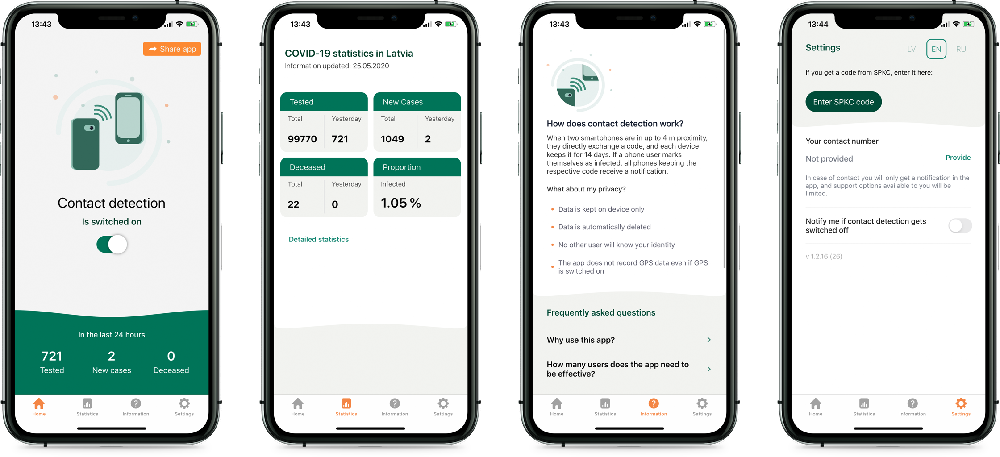

This source code is a property of [Centre for Disease Prevention and Control (CDPC) of Latvia](https://spkc.gov.lv/). You are free to use it accordingly to the Licence terms, and we would like to hear from you if you find it useful. Please drop us an email to: pasts@spkc.gov.lv

# SPKC Apturi Covid Android Application

This project's goal is to delay and mitigate the impact of SARS-CoV-2 by developing the official Apturi Covid (Stop Covid) Android application for the Republic of Latvia, utilising Google's [Exposure Notification](https://www.google.com/covid19/exposurenotifications/) Framework.

### Usage of the Exposure Notification Framework

Only approved health authorities can access these APIs. Therefore, framework calls will result in API error unless the application Bundle ID and signature keystore hash is whitelisted by Google.

## How it works

Application functionality is based on Google's Exposure Notification Framework. Application directly is not interacting with Bluetooth LE in any way. Bluetooth key transmission and receiving is handled entirely by EN Framework. Please [read more here](https://www.google.com/covid19/exposurenotifications/) regarding the implementation specifics of the Framework.

Application communicates with the server and exchanges information only to perform the following actions:
1. Phone number verification (with user consent)
1. Fetching exposure detection configuration. Detailed information [here](https://www.google.com/covid19/exposurenotifications/)
1. Downloading publicly available batches of TEKs (Temporary Exposure Keys)
1. Uploading anonymous exposure events (with user consent)

### Exposure Detection

Exposure Detection is performed at every application launch and every 60 minutes by `WorkManager` scheduled worker `ExposureKeyFetchWorker`. Application stores analysed baches for 14 days to ensure the display of a potential exposure.

## Development
1. Android Studio 4.0
1. Add Firebase configuration: place your `google-services.json` under the `/app` directory
1. Copy the `dev-keystore.properties.example` file to `dev-keystore.properties` and set the development keystore information.
1. Copy the `secrets.properties.example` file to `secrets.properties` and set the [SafetyNet](https://developer.android.com/training/safetynet/attestation) key.

## Support & Feedback

Contributions and feedback is always welcome. If you have encountered and issue, have an improvement in mind or an implementation question, please use the issues section.

### Vulnerability reporting

If you believe you have found a security vulnerability, please submit your report to us as described in the issues section.

## License

This work is licensed under [Creative Commons Attribution-ShareAlike 4.0 International](https://creativecommons.org/licenses/by-sa/4.0/)

## Contributors ❤️✨

